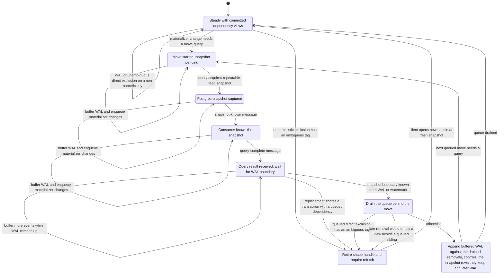
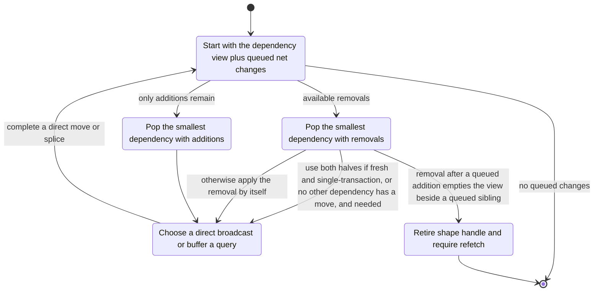

# Subquery move statecharts

## Consumer and move query

```mermaid
stateDiagram-v2
    state "Steady with committed dependency views" as Steady
    state "Move started, snapshot pending" as Starting
    state "Postgres snapshot captured" as Captured
    state "Consumer knows the snapshot" as Known
    state "Query result received, wait for WAL boundary" as Complete
    state "Drain the queue behind the move" as Drain
    state "Append buffered WAL against the drained removals, controls, the snapshot rows they keep and later WAL" as Splice
    state "Retire shape handle and require refetch" as Reset
    [*] --> Steady
    Steady --> Steady: WAL or unambiguous direct exclusion on a non-numeric key
    Steady --> Starting: materializer change needs a move query
    Steady --> Reset: deterministic exclusion has an ambiguous tag
    Starting --> Captured: query acquires repeatable-read snapshot
    Captured --> Known: snapshot-known message
    Known --> Complete: query-complete message
    Starting --> Starting: buffer WAL and enqueue materializer changes
    Captured --> Captured: buffer WAL and enqueue materializer changes
    Known --> Known: buffer WAL and enqueue materializer changes
    Complete --> Complete: buffer more events while WAL catches up
    Complete --> Drain: snapshot boundary known from WAL or watermark
    Complete --> Reset: replacement shares a transaction with a queued dependency
    Drain --> Reset: queued direct exclusion has an ambiguous tag
    Drain --> Reset: late removal would empty a view beside a queued sibling
    Drain --> Splice: otherwise
    Splice --> Starting: next queued move needs a query
    Splice --> Steady: queue drained
    Reset --> Steady: client opens new handle at fresh snapshot
```

## Queue draining

```mermaid
stateDiagram-v2
    state "Start with the dependency view plus queued net changes" as Pending
    state "Pop the smallest dependency with removals" as Remove
    state "Pop the smallest dependency with additions" as Add
    state "Choose a direct broadcast or buffer a query" as Apply
    state "Retire shape handle and require refetch" as Reset
    [*] --> Pending
    Pending --> Remove: available removals
    Pending --> Add: only additions remain
    Remove --> Apply: use both halves if fresh and single-transaction, or no other dependency has a move, and needed
    Remove --> Reset: removal after a queued addition empties the view beside a queued sibling
    Remove --> Apply: otherwise apply the removal by itself
    Add --> Apply
    Apply --> Pending: complete a direct move or splice
    Pending --> [*]: no queued changes
    Reset --> [*]
```
